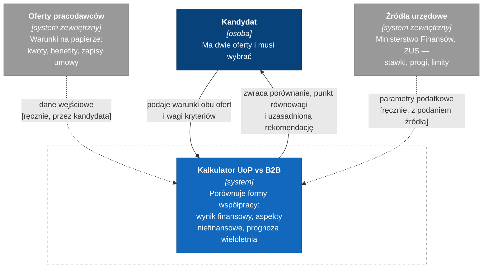

# C4 poziom 1 — kontekst systemu

Najszerszy poziom zoomu: **czym jest system, kto go używa i z czym się styka.**
Odbiorcą tego diagramu jest ktoś, kto widzi projekt pierwszy raz.

Świadomie nie ma tu ani jednej informacji technicznej — żadnego Pythona, YAML-a czy Streamlita.
To poziom 2 (`c4-02-container.md`).

## Jak czytać ten diagram

**Linia ciągła** to interakcja użytkownika z systemem. **Linia przerywana** to przepływ danych,
który — i to jest tu najważniejsze — **jest ręczny**.

Obie strzałki przerywane niosą adnotację „ręcznie". To nie jest niedoróbka, tylko
udokumentowane ograniczenie: środowisko, w którym powstaje projekt, **nie ma dostępu do
internetu**. Kalkulator nigdy nie pobierze stawek sam. Ktoś je wpisze i podpisze się pod
źródłem.

Diagram, który pokazywałby automatyczne pobieranie parametrów z API Ministerstwa Finansów,
byłby ładniejszy i kłamliwy. **Architektura opisuje system, który istnieje, a nie ten, który
byłby przyjemny.**

## Granice systemu — co świadomie jest na zewnątrz

| Poza systemem | Dlaczego |
|---|---|
| Oferty pracodawców | Dane wejściowe, których nie kontrolujemy ani nie weryfikujemy |
| Źródła urzędowe | Zewnętrzne, zmienne w czasie, dostępne wyłącznie ręcznie |
| Doradztwo podatkowe | To narzędzie **nie jest** poradą podatkową ani prawną |
| Księgowość, JPK, faktury | Poza zakresem PoC — liczymy decyzję, nie prowadzimy działalności |

## Nota notacyjna

Mermaid ma dedykowaną składnię `C4Context`, ale jest **eksperymentalna** i renderuje się
zależnie od wersji silnika. Diagramy C4 rysujemy więc na `flowchart` — składni obsługiwanej
stabilnie wszędzie, w tym w natywnym renderowaniu GitHuba.

To wybór świadomy: **notacja ma renderować się w narzędziach, których faktycznie używamy.**
Diagram, którego nie widać, nie istnieje. Decyzja zostanie sformalizowana jako ADR 0007.

---

Poziom niżej: [`c4-02-container.md`](c4-02-container.md) — z czego system się składa.
